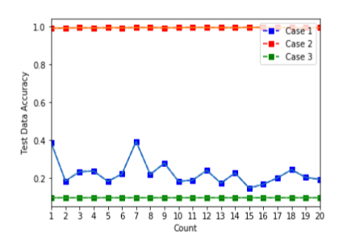
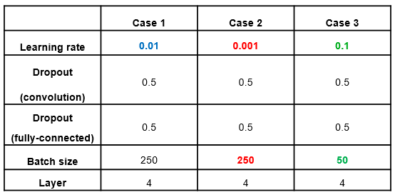
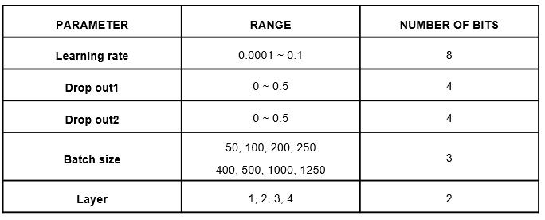
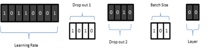
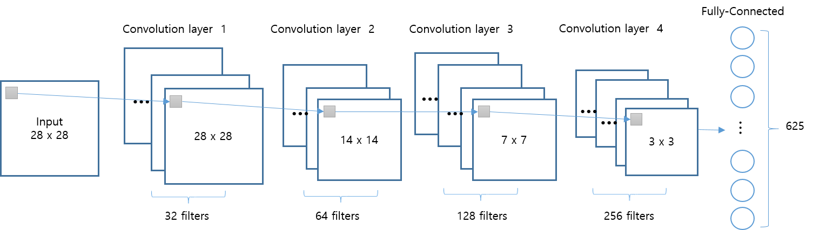
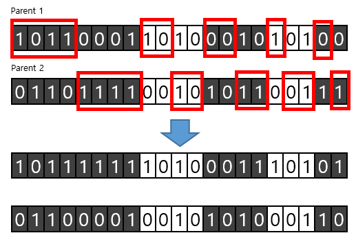
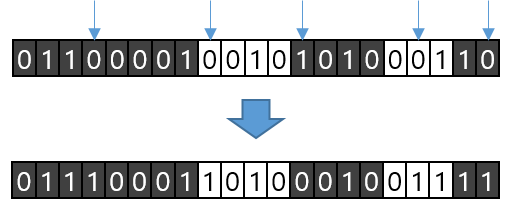

# CNN Hyperparameter Optimization using Genetic Algorithm

### 1. 프로젝트 기간 : 
- 2019.03 ~ 2019.09 

### 2. 프로젝트 주제 선정 이유 : 
- Hyperparameter는 학습으로 얻어지는 parameter가 아닌 모델 적용 전 사용자가 직접 값을 설정해야 하는 값
- CNN 모델을 올바르게 생성해도 hyperparameter 값을 잘못 설정하여 학습을 제대로 하지 못할 가능성 존재

   

- 최적의 hyperparameter 값 구하는 연구 필요

### 3. 프로젝트 목적 :
- CNN 모델의 가장 높은 데이터 분류 정확도 얻기 위해 필요한 최적의 hyperparameter 값 획득

### 4. 프로젝트 과정 : 
#### 4.1. 알고리즘 선택 

  > - 많은 수의 parameter 동시에 최적화하기 적절한 유전 알고리즘(Genetic Algorithm, GA) 선택
  
<!--   >  -->

 

#### 4.2. 데이터 선정  

  > - MNIST 데이터 선택
  > - 획득하기 쉬워서 재구현 가능
 
  
#### 4.3. 최적화 할 Hyperparameter 선택  
  > 1. 한번에 얼마나 학습을 할 지 정하는 learning rate
  > 2. Convolution layer에 적용된 dropout (Dropout1) 
  > 3. Fully-connected layer에 적용된 dropout (Droput2)
  > 4. 한번에 얼마나 학습을 할 지 정해주는 batch size
  > 5. Convolution layer의 수 (Layer)

  > 총 5개의 hyperparameter 선택

#### 4.4. 초기 세대 생성
  > 

  > - 최적화 할 hyperparamete들을 유전자라고 하며, 정해진 숫자의 비트수로 이진화하는 인코딩 과정 필요
  
  > 

  > - 다섯 개의 유전자들을 모아 하나의 염색체 구성

  > 

  > - 각 유전자의 설정 범위 안에서 값을 임의로 선택하여 50개의 염색체를 생성하고 이를 초기 모집단이라 함

#### 4.5. CNN 모델 설계
  > 

#### 4.6. 적합도 평가
  > 분류의 정확도로 적합도를 평가

#### 4.7. 부모 염색체 선택
  > 적합도가 높을 수록 부모 염색체로 선택될 확률이 높음

#### 4.8 자식 염색체 선택
  > 
  > crossover 과정
  
  > 
  > mutation 과정

#### 4.9 반복
  > 6번부터 8번까지의 과정을 50세대 반복
