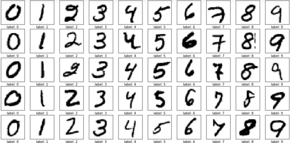

# CNN Hyperparameter Optimization using Genetic Algorithm

### 1. 프로젝트 기간 : 
- 2019.01 ~ 2019.09 

 
 

### 2. 주제 선정 이유 : 
- Hyperparameter는 학습으로 얻어지는 parameter가 아닌 모델 적용 전 사용자가 직접 값을 설정해야 하는 값
- CNN 모델을 올바르게 생성해도 hyperparameter 값을 잘못 설정하여 학습을 제대로 하지 못할 가능성 존재

 
 

   

 

 

   

  >- hyperparamter 값의  차이로 정확도가 달라짐을 확인 

 

- 최적의 hyperparameter 값 구하는 연구의 필요성을 느낌

 
 

### 3. 프로젝트 목적 :
- CNN 모델의 가장 높은 데이터 분류 정확도 얻기 위해 필요한 최적의 hyperparameter 값을 획득

 
 

### 4. 프로젝트 과정 : 
#### 4.1. 알고리즘 선택 

  - 많은 수의 parameter 동시에 최적화하기 적절한 유전 알고리즘(Genetic Algorithm, GA) 선택

 

#### 4.2. 데이터 선정  

  - MNIST 데이터 선택
     
    
 

    
     
    - 가장 보편적이고 획득하기 쉽기 때문에 누구나 재구현 가능

 
  
#### 4.3. 최적화 할 Hyperparameter 선택  
  1. 한번에 얼마나 학습을 할 지 정하는 learning rate
  1. Convolution layer에 적용된 dropout (Dropout1) 
  1. Fully-connected layer에 적용된 dropout (Dropout2)
  1. 한번에 얼마나 학습을 할 지 정해주는 batch size
  1. Convolution layer의 수 (Layer)

   

  -  총 5개의 hyperparameter 선택

 

#### 4.4. 초기 세대 생성
   

  

  
   
  
  - 선택된 hyperparameter들을 이 실험해서 구해야하는 값, 즉 유전알고리즘에서는  유전자라 함
  - 각 유전자들은 정해진 숫자의 비트수로 이진화하는 인코딩 과정 거침
  
   
  
  

   
  
  - 다섯 개의 유전자들을 모아 하나의 염색체 구성
  - 나의 염색체는 21비트로 구성된

  

  
   

  - 각 유전자의 설정 범위 안에서 값을 임의로 선택하여 50개의 염색체를 생성하고 이를 초기 모집단이라 함

 

#### 4.5. CNN 모델 설계 및 적용

  

 

#### 4.6. 적합도 평가
  - 분류의 정확도로 적합도를 평가
    - 이 실험에서는 test 데이터의 정확도

 

#### 4.7. 부모 염색체 선택
  - 적합도가 높을 수록 부모 염색체로 선택될 확률이 높음

 

#### 4.8 자식 염색체 선택
  - crossover 과정
  

  
   

  - mutation 과정
  

 

  

  - crossover, mutation 확률
  

  
 

#### 4.9 반복
  - 6번부터 8번까지의 과정을 50세대 반복

 
  
  

 
 

### 5. 결과

 

- **learning rate**
  - learning rate 범위는 0.0001에서 0.1로 넓게 설정
  - 최적의 값은 0.0005에서 0.0015사이의 작은 값들을 가짐 

   

- **dropout1**
  - covoluton layer에 적용되는 dropout rate
  - 대략 0.2 정도의 값을 가짐

   

- **dropout2**
  - fully-connected layer에 적용되는 dropout rate
  - 0.3 ~ 0.4 정도의 값을 가짐
  - fully-connected layer가 학습해야하는 파라미터의 수가 많기 때문에 값이 더 클 가능성이 있음

   

- **batch Size**
  - batch size의 범위를 50에서 1250 으로 넓게 설정 
  - 50에서 250사이의 값들을 가짐

   

- **layer**
  - convolution layer는 적어도 3개 이상의 layer가 필요
