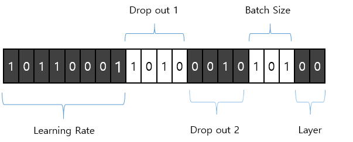

# CNN Hyperparameter Optimization using Genetic Algorithm

### 1. 프로젝트 기간 : 
- 2019.03 ~ 2019.09 

### 2. 프로젝트 주제 선정 이유 : 
- Hyperparameter는 학습으로 얻어지는 parameter가 아닌 모델 적용 전 사용자가 직접 값을 설정해야 하는 값
- CNN 모델을 올바르게 생성해도 hyperparameter 값을 잘못 설정하여 학습을 제대로 하지 못할 가능성 존재

   

- 최적의 hyperparameter 값 구하는 연구 필요

### 3. 프로젝트 목적 :
- CNN 모델의 가장 높은 데이터 분류 정확도 얻기 위해 필요한 최적의 hyperparameter 값 획득

### 4. 프로젝트 과정 : 
#### 4.1. 알고리즘 선택 

  > - 많은 수의 parameter 동시에 최적화하기 적절한 유전 알고리즘(Genetic Algorithm, GA) 선택

 

#### 4.2. 데이터 선정  

  > - MNIST 데이터 선택
  
 
  
#### 4.3. 최적화 할 Hyperparameter 선택  
  > 1. 한번에 얼마나 학습을 할 지 정하는 learning rate
  > 2. Convolution layer에 적용된 dropout (Dropout1) 
  > 3. Fully-connected layer에 적용된 dropout (Droput2)
  > 4. 한번에 얼마나 학습을 할 지 정해주는 batch size
  > 5. Convolution layer의 수 (Layer)

  > 총 5개의 hyperparameter 선택

#### 4.4. 초기 세대 생성
  > 

  > - 최적화 할 hyperparamete들을 유전자라고 하며, 정해진 숫자의 비트수로 이진화하는 인코딩 과정 필요
  
  > 
